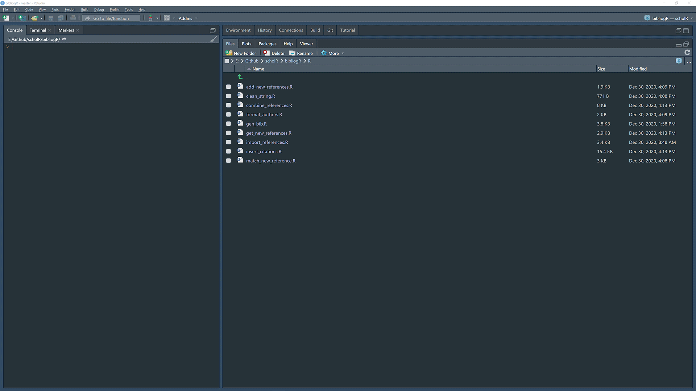
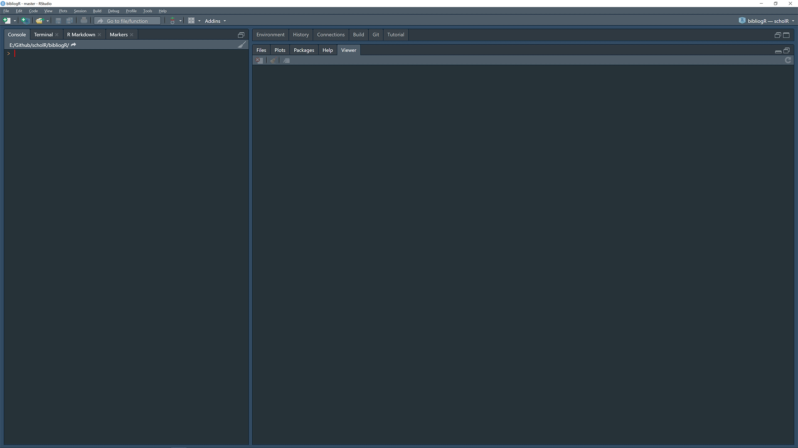
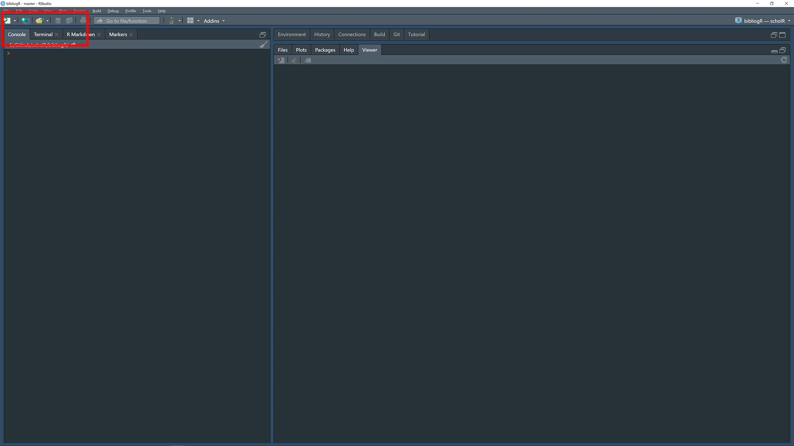
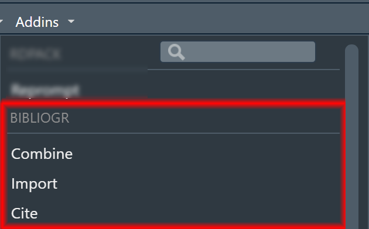

<!-- badges: start -->

[](https://github.com/NicolasJBM/bibliogR/actions)
[](https://www.codefactor.io/repository/github/nicolasjbm/bibliogR)
[](https://opensource.org/licenses/GPL-3.0)
[](https://www.tidyverse.org/lifecycle/#experimental)
<!-- badges: end -->

# bibliogR 

Toolbox to search and cite the Literature.

## Overview

*bibliogR* offers a set of tools to update a list of references, import
it into R, and cite prior literature in Rmarkdown documents. To
manipulate .bib files, I recomment using
[JabRef](%22https://www.fosshub.com/JabRef.html%22).

## Installation

Before you can install *bibliogR* itself, you will need to install from
CRAN the following R packages:

``` r
install.packages(
  "miniUI", "shiny", "shinythemes", "dplyr", "purrr", "stringr", "stringi",
  "stringdist", "readxl", "WriteXLS", "tibble", "utils", "RefManageR",
  "readr", "tidyr", "stats", "DT", "glue", "knitr", "rstudioapi",
  "future", "furrr",
  dependencies = TRUE
)
```

Since the package uses some functions from the *lexR* package to clean
text (i.e. to force ASCII format to export to .bib files), you will need
to install it first:

``` r
devtools::install.github("NicolasJBM/lexR")
```

Then, install *biliogR* from its GitHub public repository:

``` r
devtools::install.github("NicolasJBM/bibliogR")
```

## Usage

The application *combine\_references()* allows you to select files to be
imported from .bib files and then properly formatted. Potential
duplicates are identified and the possibility to select which version to
keep is offered. Finally, unique keys are generated for the new
references which are appended to the old reference list. The output is a
new Excel file containing all your references, references\_new.xlsx.

``` r
bibliogR::combine_references()
```

or with the add-in:



This Excel file can then be imported into your R environment with the
function *import\_references()* which opens an application to browse
your folder to find and select the appropriate file. The function will
then replace the references in the *bibliogR* package folder on your
system.

``` r
bibliogR::import_references()
```

or with the add-in:



Finally, *insert\_citations()* allows you to search for citations and
insert them in a Rmarkdown document, while the function *gen\_bib()*
placed in the setup chunk of this document will generate the necessary
.bib file for that document.

``` r
bibliogR::insert_citations()
```

or with the add-in:



Note that the applications *combine\_references()*,
*import\_references()*, and *insert\_citations()* are also accessible
though RStudio’s addins:



## Toolboxes

*bibliogR* requires *[lexR](https://github.com/NicolasJBM/lexR)* and is
particularly useful in combination with
*[writR](https://github.com/NicolasJBM/writR)*.
